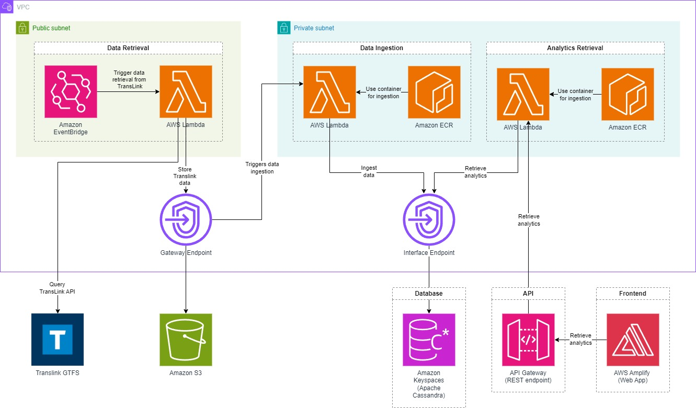

# Translytics: TransLink Analytics

Public transit reliability often frustrates commuters due to inaccurate scheduling. Currently, insights based on historical data are severely lacking in existing solutions, such as the Transit app. This project addresses these challenges by developing a web application that delivers analytics on TransLink bus performance through an intuitive dashboard. Users can assess metrics like average delays, lateness patterns, and route statistics, enabling informed route planning.

Deployed with AWS Amplify: https://main.d3mj2q6l6unypg.amplifyapp.com/

## Architecture

### AWS Services Used
- Eventbridge
- Lambda
- S3
- Keyspaces
- ECR
- Amplify
- API Gateway

## Fun Facts & Info
### Performance
- Eventbridge triggers every 10 minutes --> database and visualizations update approximately every 10 minutes as well
- Lambdas take 2-40 seconds
- Keyspaces (Cassandra) is a column-family database that works well with data aggregation, scaling with data, and has high availability & performance 
### Costs
- $9 per month + $0.10 per thousand visits
### Security
- custom IAM roles & policies were created to ensure access is only granted where needed
- VPC with public and private subnets minimize attack surface for DDoS attacks

## Setup & Running Locally
 - Install Node (v18.11.18, but any v18 should work)
 - run `npm install` in the root directory and `npm install --legacy-peer-deps` in the frontend directory
 - run `npm start` 
